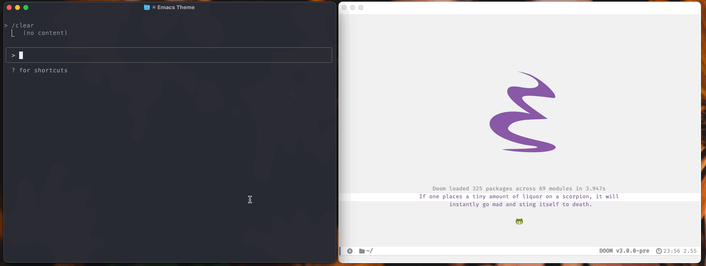
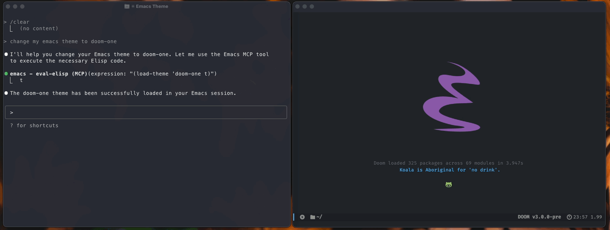

# MCP Server for Emacs

[](https://github.com/rhblind/emacs-mcp-server/actions/workflows/test.yml)
[](https://www.gnu.org/licenses/gpl-3.0)
[](https://www.gnu.org/software/emacs/)

Connect Large Language Models directly to your Emacs environment! This MCP (Model Context Protocol) server exposes Emacs functionality through standardized tools, allowing LLMs like Claude to read and modify your buffers, execute elisp code, navigate files, and much more.

<div align="center">
  
  <br><br>
  
</div>

## Quick Start

**Installation:** Place the files in your Emacs configuration directory and add to your config:

```elisp
(add-to-list 'load-path "~/path-to/mcp-server")
(require 'mcp-server)
```

Alternatively, use package managers:

```elisp
;; Using straight.el
(use-package mcp-server
  :straight (:type git :host github :repo "rhblind/emacs-mcp-server"
             :files ("*.el" "mcp-wrapper.py" "mcp-wrapper.sh"))
  :config
  (add-hook 'emacs-startup-hook #'mcp-server-start-unix))

;; Using use-package with manual path
(use-package mcp-server
  :load-path "~/path-to/mcp-server"
  :config
  (add-hook 'emacs-startup-hook #'mcp-server-start-unix))

;; Using Doom Emacs package! macro
(package! mcp-server
  :recipe (:type git :host github :repo "rhblind/emacs-mcp-server"
           :files ("*.el" "mcp-wrapper.py" "mcp-wrapper.sh")))
```

**Start the server:** Run `M-x mcp-server-start-unix` in Emacs. The server creates a Unix socket at `~/.config/emacs/.local/cache/emacs-mcp-server.sock` (or similar based on your Emacs configuration).

**Connect Claude Desktop:** Add this to your Claude Desktop configuration:

> [!NOTE]
> Make sure you have `socat` installed!

```json
{
  "mcpServers": {
    "emacs": {
      "command": "socat",
      "args": ["-", "UNIX-CONNECT:~/.config/emacs/.local/cache/emacs-mcp-server.sock"],
      "transport": "stdio"
    }
  }
}
```

**Connect Claude CLI**

```bash
claude mcp add emacs ~/path-to/mcp-wrapper.py ~/.config/emacs/.local/cache/emacs-mcp-server.sock           # Uses the python script
claude mcp add emacs ~/path-to/mcp-wrapper.sh ~/.config/emacs/.local/cache/emacs-mcp-server.sock           # Uses the bash script
claude mcp add emacs-direct -- socat - UNIX-CONNECT:$HOME/.config/emacs/.local/cache/emacs-mcp-server.sock # Uses socat directly

# Real world, add to user scope so it's always available
claude mcp add emacs --scope user ~/.config/emacs/.local/straight/build-30.1/mcp-server/mcp-wrapper.py ~/.config/emacs/.local/cache/emacs-mcp-server.sock
```

**That's it!** Claude can now interact with your Emacs session.

## What LLMs Can Do

Once connected, LLMs can perform powerful operations in your Emacs environment:

**Code and Text Manipulation**
- Read and write any buffer - get content from files, scratch buffers, terminals
- Execute elisp code - run any Emacs Lisp expression safely 
- Navigate and edit - move cursor, insert text, select regions
- Manage files - open, save, create new files and buffers

**Emacs Integration**
- Run interactive commands - execute any `M-x` command programmatically
- Access variables - read and modify Emacs configuration and state
- Window management - get layout information, manage splits
- Major mode operations - work with mode-specific functionality

**Example Interactions:**
- *"Add a docstring to this function"* → Claude reads your buffer, analyzes the function, and adds proper documentation
- *"Refactor this code to use modern Python"* → Claude reads the code, suggests improvements, and can apply changes directly
- *"Create a new React component file"* → Claude creates the file, adds boilerplate code, and opens it in a buffer
- *"Fix the indentation in this buffer"* → Claude reads the content and applies proper formatting

## Available Tools

**Current Tool:**
- `eval-elisp` - Execute arbitrary elisp expressions safely and return the result

**What you can do now:** With the `eval-elisp` tool, you can already accomplish a lot! LLMs can:
- Read any buffer: `(buffer-string)` or `(with-current-buffer "filename.txt" (buffer-string))`
- Write to buffers: `(insert "text")` or `(with-current-buffer "filename.txt" (insert "text"))`
- Navigate files: `(find-file "path/to/file")` or `(switch-to-buffer "buffer-name")`
- Get cursor position: `(point)` or `(line-number-at-pos)`
- Move cursor: `(goto-char 100)` or `(goto-line 50)`
- Get selections: `(if (region-active-p) (buffer-substring (region-beginning) (region-end)) "No selection")`
- List buffers: `(mapcar #'buffer-name (buffer-list))`
- Execute commands: `(call-interactively 'command-name)` or `(command-name)`
- Access variables: `variable-name` or `(setq variable-name value)`

**Planned tools** for future implementation include dedicated functions for buffer management (`get-buffer-content`, `set-buffer-content`, `get-buffer-list`), navigation (`get-point`, `goto-point`, `insert-at-point`), variable access (`get-variable`, `set-variable`), and window operations (`get-window-configuration`).

## Configuration

**Socket naming strategies:** Choose how sockets are named based on your setup:

```elisp
(setq mcp-server-socket-name nil)       ; Default: emacs-mcp-server.sock
(setq mcp-server-socket-name 'user)     ; User-based: emacs-mcp-server-{username}.sock  
(setq mcp-server-socket-name 'session)  ; Session-based: emacs-mcp-server-{username}-{pid}.sock
(setq mcp-server-socket-name "custom")   ; Custom: emacs-mcp-server-custom.sock
```

**Other configuration options:**

```elisp
;; Custom socket directory
(setq mcp-server-socket-directory "~/.config/emacs-mcp/")

;; Auto-start server when Emacs starts
(add-hook 'emacs-startup-hook #'mcp-server-start-unix)

;; Enable debug logging
(setq mcp-server-debug t)
```

## Security

The MCP server implements comprehensive security measures to protect your Emacs environment and sensitive data from unauthorized access by LLMs.

### Security Features

**Permission System:**
- **Dangerous function protection** - Functions like `delete-file`, `shell-command`, `find-file` require user approval
- **Sensitive file protection** - Automatic blocking of credential files (`.authinfo`, `.netrc`, SSH keys, etc.)
- **Buffer access controls** - Protection for sensitive buffers like `*Messages*`, `*shell*`, `*terminal*`
- **Permission caching** - Decisions are remembered for the session to avoid repeated prompts
- **Audit logging** - Complete trail of all security events and decisions

**Input Validation:**
- **JSON Schema validation** - All tool inputs are validated against defined schemas
- **Code injection protection** - Elisp expressions are scanned for dangerous patterns
- **Path traversal prevention** - File paths are validated to prevent directory escape attacks
- **Content scanning** - File contents are checked for credential patterns before access

**Execution Limits:**
- **Timeout protection** - Operations are limited to 30 seconds by default
- **Memory monitoring** - Resource usage is tracked during execution
- **Safe evaluation** - All Elisp code goes through security validation before execution

### Default Protected Files

The server automatically protects these sensitive file patterns:

**Authentication Files:**
- `~/.authinfo*` - Emacs authentication data
- `~/.netrc*` - Network authentication credentials  
- `~/.ssh/` - SSH keys and configuration
- `~/.gnupg/` - GPG keys and configuration

**Cloud & Service Credentials:**
- `~/.aws/` - AWS credentials
- `~/.docker/config.json` - Docker authentication
- `~/.kube/config` - Kubernetes configuration
- `~/.config/gh/` - GitHub CLI credentials

**System Files:**
- `/etc/passwd`, `/etc/shadow` - System authentication
- `~/.password-store/` - Password manager data
- Files containing "passwords", "secrets", "credentials", "keys", "tokens"

### Security Configuration

Users have complete control over the security model through customizable settings:

**Customize Sensitive Files:**
```elisp
;; Add your own sensitive file patterns
(setq mcp-server-security-sensitive-file-patterns
      '("~/.authinfo" "~/.ssh/" "~/my-secrets/" "*.key"))

;; Allow specific sensitive files without prompting
(setq mcp-server-security-allowed-sensitive-files
      '("~/.authinfo" "~/safe-config.txt"))
```

**Customize Dangerous Functions:**
```elisp
;; Modify which functions require permission
(setq mcp-server-security-dangerous-functions
      '(delete-file shell-command find-file write-region))

;; Allow specific functions without prompting  
(setq mcp-server-security-allowed-dangerous-functions
      '(find-file dired))  ; Allow file browsing freely
```

**Global Security Settings:**
```elisp
;; Disable all permission prompts (not recommended)
(setq mcp-server-security-prompt-for-permissions nil)

;; Customize execution timeout
(setq mcp-server-security--max-execution-time 60)  ; 60 seconds

;; Add custom sensitive buffer patterns
(setq mcp-server-security-sensitive-buffer-patterns
      '("*Messages*" "*shell*" "*my-secure-buffer*"))
```

**Use Emacs Customize Interface:**
```elisp
M-x customize-group RET mcp-server RET
```

### Security Modes

**Paranoid Mode (Maximum Security):**
```elisp
;; Very restrictive - prompts for everything
(setq mcp-server-security-dangerous-functions
      '(find-file insert-file-contents switch-to-buffer eval load require))
(setq mcp-server-security-allowed-dangerous-functions nil)
(setq mcp-server-security-prompt-for-permissions t)
```

**Permissive Mode (Development):**
```elisp
;; More relaxed for trusted development scenarios
(setq mcp-server-security-allowed-dangerous-functions
      '(find-file dired switch-to-buffer insert-file-contents))
;; Keep file protections for credentials
(setq mcp-server-security-sensitive-file-patterns
      '("~/.authinfo*" "~/.netrc*" "~/.ssh/" "~/.gnupg/"))
```

**Whitelist-Only Mode (Ultra Secure):**
```elisp
;; Only allow explicitly whitelisted operations
(setq mcp-server-security-prompt-for-permissions nil)  ; No prompts - just deny
(setq mcp-server-security-allowed-dangerous-functions '(buffer-string point))
(setq mcp-server-security-allowed-sensitive-files nil)  ; No sensitive files allowed
```

### Monitoring Security

**View Security Activity:**
```elisp
M-x mcp-server-security-show-audit-log     ; View all security events
M-x mcp-server-security-show-permissions   ; View cached permission decisions
M-x mcp-server-security-clear-permissions  ; Reset all cached permissions
```

**Security Events Include:**
- Permission requests (granted/denied)
- Sensitive file access attempts
- Dangerous function calls
- Security configuration changes
- Execution timeouts and errors

### Best Practices

1. **Keep defaults** - The default security settings provide good protection for most users
2. **Review audit logs** - Regularly check what the LLM has been trying to access
3. **Use whitelists** - For recurring workflows, whitelist specific safe operations
4. **Monitor credentials** - Be especially careful with any files containing passwords or API keys
5. **Test security** - Verify your configuration blocks unauthorized access as expected

Operations requiring explicit permission include file system operations (`delete-file`, `write-region`), process execution (`shell-command`, `call-process`), system functions (`kill-emacs`, `server-start`), and access to sensitive files or buffers.

## Management Commands

**Server control:** `M-x mcp-server-start-unix` (start), `M-x mcp-server-stop` (stop), `M-x mcp-server-restart` (restart), `M-x mcp-server-status` (show status)

**Debugging and monitoring:** `M-x mcp-server-toggle-debug` (toggle debug logging), `M-x mcp-server-list-clients` (show connected clients), `M-x mcp-server-get-socket-path` (show socket path)

**Security management:** `M-x mcp-server-security-show-audit-log` (view security log), `M-x mcp-server-security-show-permissions` (view cached permissions)

## Client Integration

### Claude Desktop

**Using shell wrapper (recommended):**
```json
{
  "mcpServers": {
    "emacs": {
      "command": "/path/to/mcp-wrapper.sh",
      "args": ["$HOME/.emacs.d/.local/cache/emacs-mcp-server.sock"],
      "transport": "stdio"
    }
  }
}
```

**Using Python wrapper:**
```json
{
  "mcpServers": {
    "emacs": {
      "command": "python3",
      "args": ["/path/to/mcp-wrapper.py", "$HOME/.emacs.d/.local/cache/emacs-mcp-server.sock"],
      "transport": "stdio"
    }
  }
}
```

**Direct socat (simple but less robust):**
```json
{
  "mcpServers": {
    "emacs": {
      "command": "socat",
      "args": ["-", "UNIX-CONNECT:$HOME/.emacs.d/.local/cache/emacs-mcp-server.sock"],
      "transport": "stdio"
    }
  }
}
```


### Wrapper Scripts

**Shell wrapper (`mcp-wrapper.sh`)** - Lightweight, uses socat, good for simple integrations:
```bash
./mcp-wrapper.sh ~/.emacs.d/.local/cache/emacs-mcp-server.sock
./mcp-wrapper.sh /custom/path/emacs-mcp-server-myinstance.sock
EMACS_MCP_DEBUG=1 ./mcp-wrapper.sh ~/.emacs.d/.local/cache/emacs-mcp-server.sock
```

**Python wrapper (`mcp-wrapper.py`)** - More robust error handling, better cross-platform support:
```bash
./mcp-wrapper.py ~/.emacs.d/.local/cache/emacs-mcp-server.sock
./mcp-wrapper.py --list-sockets
EMACS_MCP_DEBUG=1 ./mcp-wrapper.py ~/.emacs.d/.local/cache/emacs-mcp-server.sock
```

**Environment variables** for both wrappers:
- `EMACS_MCP_TIMEOUT`: Connection timeout in seconds (default: 10)
- `EMACS_MCP_DEBUG`: Enable debug logging

### Custom MCP Client

For your own MCP client implementation:

```python
import socket
import json

# Connect to Emacs MCP Server
sock = socket.socket(socket.AF_UNIX, socket.SOCK_STREAM)
sock.connect("~/.emacs.d/.local/cache/emacs-mcp-server.sock")

# Send initialization
init_msg = {
    "jsonrpc": "2.0",
    "id": 1,
    "method": "initialize",
    "params": {
        "protocolVersion": "draft",
        "capabilities": {},
        "clientInfo": {"name": "my-client", "version": "1.0.0"}
    }
}

sock.send((json.dumps(init_msg) + "\n").encode())
response = sock.recv(4096).decode()
print(response)
```

## Testing and Development

**Quick test:** Run `./test/scripts/test-runner.sh` or test a specific socket with `./test/integration/test-unix-socket-fixed.sh ~/.emacs.d/.local/cache/emacs-mcp-server.sock`

**Adding custom tools:**

```elisp
(mcp-server-tools-register
 "my-tool"
 "My Custom Tool"  
 "Description of what this tool does"
 '((type . "object")
   (properties . ((param . ((type . "string")))))
   (required . ["param"]))
 (lambda (args)
   (let ((param (alist-get 'param args)))
     (format "Result: %s" param))))
```

## Troubleshooting

**Server won't start:** Check if socket directory exists and is writable, verify no other server is using the same socket path, check Emacs *Messages* buffer for error details.

**Socket not found:**
1. Check if Emacs MCP Server is running: `M-x mcp-server-status`
2. Verify socket path: `M-x mcp-server-get-socket-path` 
3. List available sockets: `./mcp-wrapper.sh --list-sockets`

**Connection refused:**
1. Check socket permissions: `ls -la ~/.emacs.d/.local/cache/emacs-mcp-server*.sock`
2. Test socket connectivity: `echo '{"jsonrpc":"2.0","id":1,"method":"tools/list"}' | socat - UNIX-CONNECT:~/.emacs.d/.local/cache/emacs-mcp-server.sock`

**MCP client issues:**
1. Verify client configuration: Check JSON syntax and file paths
2. Check client logs: Most MCP clients provide debug logging
3. Test wrapper independently: Run wrapper script manually to verify connection

**Permission errors:** View audit log with `M-x mcp-server-security-show-audit-log`, grant specific permissions with `(mcp-server-security-grant-permission 'function-name)`, or disable prompting with `(mcp-server-security-set-prompting nil)`.

**Debug mode:** Enable with `(setq mcp-server-debug t)` or toggle with `M-x mcp-server-toggle-debug`.

## Advanced Configuration

**Multiple Emacs instances:**
```elisp
;; Instance 1
(setq mcp-server-socket-name "instance-1")
(mcp-server-start-unix)

;; Instance 2  
(setq mcp-server-socket-name "instance-2")
(mcp-server-start-unix)
```

**Dynamic socket naming:**
```elisp
(setq mcp-server-socket-name 
      (lambda () 
        (format "emacs-%s-%d" (system-name) (emacs-pid))))
```

**Performance tips:**
- Use predictable naming to avoid socket discovery overhead
- Keep connections alive and reuse when possible  
- Monitor clients with `M-x mcp-server-list-clients`
- Stop unused servers to free resources

## Architecture

The server uses a modular design with a transport layer (Unix domain sockets, TCP planned), protocol layer (JSON-RPC 2.0 message handling), tool registry (Elisp functions exposed as MCP tools), and security layer (permission management and validation).

```
┌─────────────────┐    ┌──────────────────┐    ┌─────────────────┐
│   LLM Client    │────│  Unix Socket     │────│  Emacs MCP      │
│ (Claude/Python) │    │  Transport       │    │  Server         │
└─────────────────┘    └──────────────────┘    └─────────────────┘
                                │
                       ┌──────────────────┐
                       │   MCP Tools      │
                       │   (Elisp Funcs)  │
                       └──────────────────┘
```

## License

This program is free software; you can redistribute it and/or modify it under the terms of the GNU General Public License as published by the Free Software Foundation, either version 3 of the License, or (at your option) any later version.
